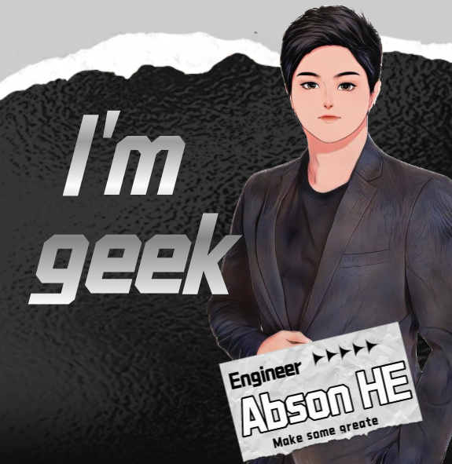

### Hi Here 👋

<!--
**Abson/Abson** is a ✨ _special_ ✨ repository because its `README.md` (this file) appears on your GitHub profile.

Here are some ideas to get you started:

- 🔭 I’m currently working on ...
- 🌱 I’m currently learning ...
- 👯 I’m looking to collaborate on ...
- 🤔 I’m looking for help with ...
- 💬 Ask me about ...
- 📫 How to reach me: ...
- 😄 Pronouns: ...
- ⚡ Fun fact: ...
-->
<body style="background-color:black;">
  

</body>

- 🔭 I'm working for myself for time being. 

- 🌱 I’m currently learning English hardly to wish to talk to you fluently in someday.

- 🤔 If you are attractived to me and have job to offer me to work, please contact me and let me konw.

- 👯 I’m looking to collaborate with other content creators

- ⚡ Fun fact I love to enjoy saxophone music and coffee alone.

- 🦸🏻‍ By the way I have worked in some company in China as a iOS developer. 

### 🌩 Pined

### 💻 Calculate 

